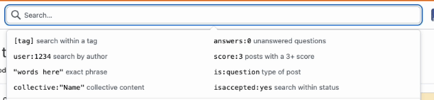
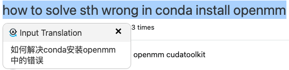
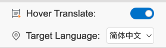

## Input Translation

- [English](README.md)

一款用于文本框翻译和划词翻译的浏览器插件。支持使用chrome内核的浏览器。

##  功能
### 输入框翻译
在输入的文本后加上`/`+目标语言的缩写，即可自动翻译。例如：

`你好/en` 会自动翻译为 `Hello`。

`Hello/kor` 会自动翻译为 `안녕하세요`。

**调节`Input Translate`选项可以开启或关闭该功能。**

#### 支持的语言

| 缩写 | 语言 | 缩写 | 语言 |
| :----: | :--------: | :----: | :--------: |
| en | 英语 | zh | 中文 |
| kor | 韩语 | jp | 日语 |
| fra | 法语 | spa | 西班牙语 |
| de | 德语 | it | 意大利语 |
| ru | 俄语 | pt | 葡萄牙语 |
| ara | 阿拉伯语 | nl | 荷兰语 |

### 划词翻译
选中文本后自动翻译为目标语言。

**调节Hover Translate选项可以开启或关闭该功能。**

**Target Language选项可以选择划词翻译的目标语言。**

## 各个网站的插件使用情况
**完美支持：** :white_check_mark:

**支持但有bug：** :heavy_check_mark: 

**不支持：** :x:

| 网站 | 是否支持 |
| :----: | :--------: |
| Google搜索 | :x:  |
| Bing搜索 | :white_check_mark:  |
| GitHub |  :heavy_check_mark: | 
| 知乎 | :white_check_mark:  | 
| stack overflow | :white_check_mark:  | 
| quora | :x:  | 
| YouTube| :white_check_mark:  |  
| 推特| :white_check_mark:  | 

## 许可证

MIT License

## 开发日志

- [note one](https://kelinkong.github.io/2024/03/05/input-translate/)
- [note two](https://kelinkong.github.io/2024/03/07/input-translation/)
