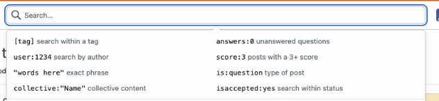
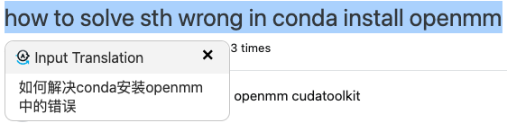

# Input Translation (输入翻译官) 🚀

[](https://opensource.org/licenses/GPL-3.0)
[](https://vitejs.dev/)

[English](./README.md)

**Input Translation** 是一款功能强大的浏览器插件，旨在优化你的跨语言工作流。它提供了输入框即时翻译、划词翻译以及地址栏快速翻译功能。

## ✨ 核心功能

### 1. 输入框翻译 (键盘魔术)
通过在文本后输入 `/` + 语言代码，即可实现即时翻译。
- **使用方法:** 输入 `你好/en` -> 按空格或回车 -> 自动变为 `Hello`。
- **支持语言代码:** `en` (英), `zh` (中), `jp` (日), `kor` (韩), `fra` (法), `spa` (西), `de` (德), `it` (意), `ru` (俄), `pt` (葡), `ara` (阿), `nl` (荷)。



### 2. 地址栏快速翻译 (Omnibox)
直接在浏览器地址栏进行快速翻译并搜索，无需切换页面。
- **使用方法:** 在地址栏输入 `tr` + **空格** -> 输入 `apple/zh`。
- **即时预览:** 下拉列表会即刻显示翻译结果。
- **自动填充与搜索:** 选中结果后地址栏会自动填充翻译内容，按下**回车**将直接在 Google 中搜索该结果。

### 3. 划词/选区翻译
在网页上选中任何单词或段落，即可弹出即时翻译窗口。



---

## 🌐 网站支持情况

| 网站 | 支持状态 | 备注 |
| :---- | :----: | :---- |
| Google 搜索 | ✅ | 完美支持 |
| Bing 搜索 | ✅ | 完美支持 |
| GitHub | ✅ | 完美支持 |
| 知乎 | ✅ | 完美支持 |
| Stack Overflow | ✅ | 完美支持 |
| YouTube | ✅ | 完美支持 |
| Twitter (X) | ✅ | 完美支持 |
| Quora | ⚠️ | 部分页面存在冲突 |

---

## 🛠️ 开发与构建

本项目现在使用 **Vite** 进行 API 密钥安全管理和构建优化。

### 安装与配置
1. 克隆仓库并安装依赖: `npm install`
2. 在根目录创建 `.env` 文件，填入你的 [百度翻译 API](https://fanyi-api.baidu.com/) 密钥:
   ```env
   VITE_BAIDU_APP_ID=你的AppID
   VITE_BAIDU_KEY=你的密钥
   ```
3. 构建项目: `npm run build`
4. 在浏览器中加载 `dist/` 目录。

---

## 📜 许可证
基于 GNU GPL v3.0 许可证发布。查看 `LICENSE` 文件了解更多详情。

---

*Made with ❤️ by [kelin]*
