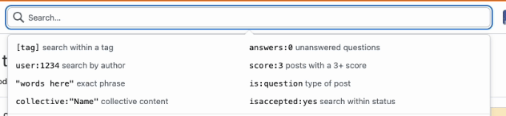
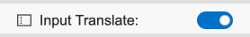

## Input Translation

- [中文说明](README-zh.md)

A browser extension for text box translation and hover translation. Supports browsers using the Chrome kernel.

## Features
### Input Box Translation
Add ` / ` + the abbreviation of the target language after the input text to automatically translate. For example:

`你好/en` will automatically translate to `Hello`.

`Hello/kor` will automatically translate to `안녕하세요`.

**Adjust the `Input Translate` option to turn this feature on or off.**

#### Supported Languages

| Abbreviation | Language | Abbreviation | Language |
| :----: | :--------: | :----: | :--------: |
| en | English | zh | Chinese |
| kor | Korean | jp | Japanese |
| fra | French | spa | Spanish |
| de | German | it | Italian |
| ru | Russian | pt | Portuguese |
| ara | Arabic | nl | Dutch |

### Hover Translation
Automatically translates selected text into the target language.

**Adjust the `Hover Translate` option to turn on or off this feature.**

**The `Target Language` option allows you to select the target language for hover translation.**

## Plugin Usage on Various Websites
**Perfectly Supported:** :white_check_mark:

**Supported but with bugs:** :heavy_check_mark: 

**Not Supported:** :x:

| Website | Support Status |
| :----: | :--------: | 
| Google Search |:white_check_mark:  |
| Bing Search | :white_check_mark:  |  
| GitHub |  :heavy_check_mark: | 
| Zhihu | :white_check_mark:  | 
| Stack Overflow | :white_check_mark:  |  
| Quora | :x:  | 
| YouTube| :white_check_mark:  |  
| Twitter| :white_check_mark:  |  

## License

MIT License

## Development Notes
- [note one](https://kelinkong.github.io/2024/03/05/input-translate/)
- [note two](https://kelinkong.github.io/2024/03/07/input-translation/)
